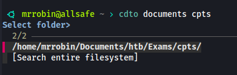
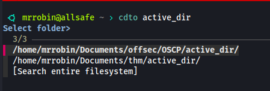
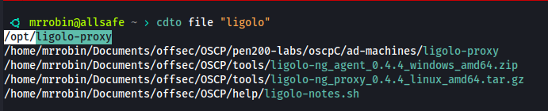

# cdto — Quick Directory & File Navigation from the Shell 

`cdto` is a lightweight command-line utility for quickly navigating to directories or locating files by name. It supports fuzzy matching, interactive selection, and optional system-wide search when no local match is found.


---

## Features

- 📁 **Directory navigation**  
  Search inside base folders:
  - `desktop` → `~/Desktop`
  - `documents` → `~/Documents`
  - `downloads` → `~/Downloads`
  - `projects` → `~/Projects`

- 🏠 **Home-wide search**  
  Omit the base to search your entire `$HOME`

- 📄 **File search with colored filenames**  
  `cdto file <name>` lists matching files and highlights filenames in color

- ⚡ **Fast search** via `fd` (`fd-find`) or fallback to `find`

- 🔍 **Interactive selection** with `fzf` if multiple matches are found

- 🔐 **Root-fallback**: prompts to search `/` with `sudo` if nothing is found in `$HOME`

---

## Requirements

- `zsh`
- `bash` (for `setup_cdto.sh`)
- `fd` (`fd-find` on Debian) or `find`
- `fzf` (for fuzzy interactive selection)

---

## Installation

1. Clone the repository:

   ```bash
   git clone https://github.com/robinx0/cdto.git ~/cdto
   cd ~/cdto
   ```

2. Run the setup script:

   ```bash
   chmod +x setup_cdto.sh
   ./setup_cdto.sh
   ```

3. Reload your shell:

   ```bash
   source ~/.zshrc
   ```

---

## Usage Examples

```bash
# Jump to ~/Documents/cpts
cdto documents cpts

# Search for 'active_dir' in all of $HOME
cdto active_dir

# Search for files containing 'proxy.py' and highlight the names
cdto file "proxy.py"

# choose to search the whole filesystem.
```

---

## Demo

### 1. Base-folder directory search



### 2. Home-wide directory search



### 3. File search with colored output



---

## License

MIT © Irfanul Montasir

